# AlcheMix Architecture

**Version**: v1.32.0
**Last Updated**: December 18, 2025

This document provides a comprehensive map of the AlcheMix system architecture, including high-level diagrams, component relationships, and data flows.

---

## Table of Contents

1. [System Overview](#system-overview)
2. [Tech Stack](#tech-stack)
3. [High-Level Architecture](#high-level-architecture)
4. [Project Structure](#project-structure)
5. [Frontend Architecture](#frontend-architecture)
6. [Backend Architecture](#backend-architecture)
7. [Database Schema](#database-schema)
8. [Authentication Flow](#authentication-flow)
9. [Data Flow](#data-flow)
10. [External Integrations](#external-integrations)
11. [Dependency Map](#dependency-map)
12. [Security Architecture](#security-architecture)

---

## System Overview

AlcheMix is a full-stack cocktail inventory and recipe management application with AI-powered bartender recommendations. The system follows a client-server architecture with a React/Next.js frontend and Express.js backend.

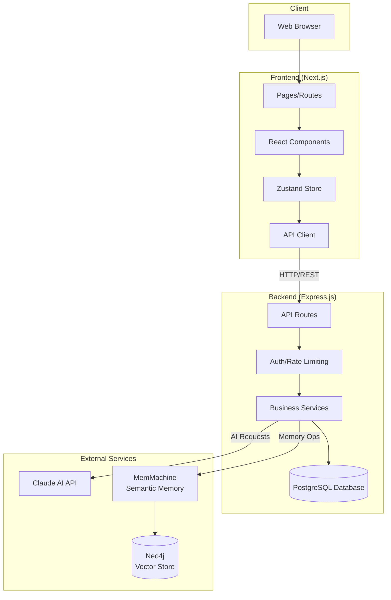

---

## Tech Stack

| Layer | Technology | Purpose |
|-------|------------|---------|
| **Frontend** | Next.js 14 | React framework with App Router |
| | TypeScript 5.3 | Type safety |
| | Zustand 4.5 | State management |
| | CSS Modules | Scoped styling |
| **Backend** | Express.js 4.18 | REST API server |
| | TypeScript | Type safety |
| | pg (node-postgres) | PostgreSQL database driver |
| **Database** | PostgreSQL 16 | Relational database |
| **AI** | Claude Sonnet 4.5 | AI bartender recommendations |
| **Memory** | PostgreSQL + MemMachine v2 | Hybrid search (exact + semantic) |
| | Neo4j 5.23 | Vector embeddings storage |
| **Auth** | JWT | Token-based authentication |
| | bcrypt | Password hashing |
| **Infrastructure** | Docker | Containerization |

---

## High-Level Architecture

```mermaid
flowchart LR
    subgraph Presentation["Presentation Layer"]
        UI[React Components]
        Pages[Next.js Pages]
        Styles[CSS Modules]
    end

    subgraph State["State Layer"]
        Auth[Auth Slice]
        Inv[Inventory Slice]
        Rec[Recipes Slice]
        Chat[Chat Slice]
    end

    subgraph Transport["Transport Layer"]
        Axios[Axios Client]
        HTTP[HTTP/REST]
    end

    subgraph API["API Layer"]
        AuthR["/auth/*"]
        InvR["/api/inventory"]
        RecR["/api/recipes"]
        MsgR["/api/messages"]
        ShopR["/api/shopping-list"]
    end

    subgraph Business["Business Layer"]
        InvS[InventoryService]
        RecS[RecipeService]
        MemS[MemoryService]
        ColS[CollectionService]
        FavS[FavoriteService]
    end

    subgraph Data["Data Layer"]
        PostgreSQL[(PostgreSQL)]
    end

    UI --> State
    State --> Axios
    Axios --> HTTP
    HTTP --> API
    API --> Business
    Business --> PostgreSQL
```

---

## Project Structure

```
alchemix/
├── src/                          # Frontend (Next.js)
│   ├── app/                      # Pages (App Router)
│   │   ├── login/               # Authentication
│   │   ├── dashboard/           # Home dashboard
│   │   ├── bar/                 # My Bar inventory
│   │   ├── recipes/             # Recipe management
│   │   ├── ai/                  # AI Bartender chat
│   │   ├── favorites/           # Saved favorites
│   │   ├── shopping-list/       # Shopping recommendations
│   │   ├── account/             # User account
│   │   ├── settings/            # App settings
│   │   ├── verify-email/        # Email verification
│   │   ├── forgot-password/     # Password reset request
│   │   └── reset-password/      # Password reset
│   │
│   ├── components/               # React Components
│   │   ├── ui/                  # Base UI components
│   │   │   ├── Button.tsx
│   │   │   ├── Card.tsx
│   │   │   ├── Input.tsx
│   │   │   ├── Modal.tsx
│   │   │   ├── Toast.tsx
│   │   │   ├── Spinner.tsx
│   │   │   ├── ElementCard.tsx
│   │   │   └── AlcheMixLogo.tsx
│   │   ├── modals/              # Modal dialogs
│   │   │   ├── AddBottleModal.tsx
│   │   │   ├── AddRecipeModal.tsx
│   │   │   ├── ItemDetailModal.tsx
│   │   │   ├── RecipeDetailModal.tsx
│   │   │   ├── CSVUploadModal.tsx
│   │   │   └── DeleteConfirmModal.tsx
│   │   ├── layout/              # Layout components
│   │   │   └── TopNav.tsx
│   │   ├── BottleCard/          # Inventory item card
│   │   ├── RecipeCard/          # Recipe card
│   │   ├── PeriodicTableV2/     # Ingredient periodic table
│   │   ├── GlassSelector/       # Glassware picker
│   │   ├── RecipeMolecule.tsx   # Molecule visualization
│   │   └── ThemeProvider.tsx    # Global theme management
│   │
│   ├── lib/                      # Utilities & State
│   │   ├── api.ts               # Axios API client
│   │   ├── store/               # Zustand store slices
│   │   │   ├── index.ts
│   │   │   ├── createAuthSlice.ts
│   │   │   ├── createInventorySlice.ts
│   │   │   ├── createRecipesSlice.ts
│   │   │   └── createChatSlice.ts
│   │   ├── periodicTableV2.ts   # Element classification
│   │   ├── formatters.ts        # Data formatters
│   │   └── passwordPolicy.ts    # Password validation
│   │
│   ├── hooks/                    # Custom React Hooks
│   │   ├── useAuthGuard.ts
│   │   ├── useVerificationGuard.ts
│   │   └── useSettings.ts        # Theme & user preferences
│   │
│   ├── styles/                   # Global Styles
│   │   └── globals.css          # Design system tokens
│   │
│   └── types/                    # TypeScript Definitions
│       └── index.ts
│
├── api/                          # Backend (Express.js)
│   └── src/
│       ├── server.ts            # Express app entry
│       ├── routes/              # API Endpoints
│       │   ├── auth.ts          # Authentication
│       │   ├── inventoryItems.ts
│       │   ├── recipes.ts
│       │   ├── collections.ts
│       │   ├── favorites.ts
│       │   ├── messages.ts      # AI chat
│       │   ├── shoppingList.ts
│       │   ├── glasses.ts
│       │   └── classifications.ts
│       ├── services/            # Business Logic
│       │   ├── AIService.ts           # Claude AI integration
│       │   ├── InventoryService.ts
│       │   ├── RecipeService.ts
│       │   ├── CollectionService.ts
│       │   ├── FavoriteService.ts
│       │   ├── MemoryService.ts
│       │   ├── EmailService.ts
│       │   ├── GlassService.ts
│       │   ├── ShoppingListService.ts # Craftability calculations
│       │   └── ClassificationService.ts
│       ├── data/                # Static Data
│       │   └── cocktailIngredients.json  # 100+ cocktail recipes for query expansion
│       ├── middleware/          # Express Middleware
│       │   ├── auth.ts
│       │   ├── csrf.ts
│       │   ├── errorHandler.ts
│       │   ├── requestId.ts
│       │   ├── requestLogger.ts
│       │   └── userRateLimit.ts
│       ├── config/              # Configuration
│       │   ├── env.ts
│       │   ├── rateLimiter.ts
│       │   └── validateEnv.ts
│       ├── database/            # Database Setup
│       │   └── db.ts
│       ├── utils/               # Utilities
│       │   ├── asyncHandler.ts
│       │   ├── corsConfig.ts
│       │   ├── inputValidator.ts
│       │   ├── logger.ts
│       │   ├── passwordValidator.ts
│       │   └── tokenBlacklist.ts
│       └── types/               # TypeScript types
│
├── packages/                     # Shared Packages
│   └── recipe-molecule/         # Molecule visualization
│       └── src/
│           ├── core/            # Parsing & layout
│           │   ├── parser.ts
│           │   ├── classifier.ts
│           │   ├── layout.ts
│           │   └── bonds.ts
│           └── components/      # React components
│               ├── Molecule.tsx
│               ├── Node.tsx
│               └── Bond.tsx
│
├── docker/                       # Docker Configuration
│   ├── docker-compose.yml
│   ├── docker-compose.dev.yml
│   ├── docker-compose.prod.yml
│   └── memmachine/              # MemMachine config
│
└── Documentation/                # Project Docs
    ├── ARCHITECTURE.md          # This file
    ├── PROJECT_PROGRESS.md
    ├── REDESIGN_PLAN.md
    └── DEV_NOTES.md
```

---

## Frontend Architecture

### Component Hierarchy

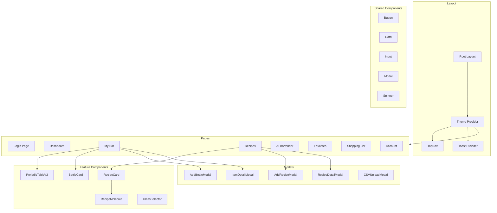

### State Management (Zustand)

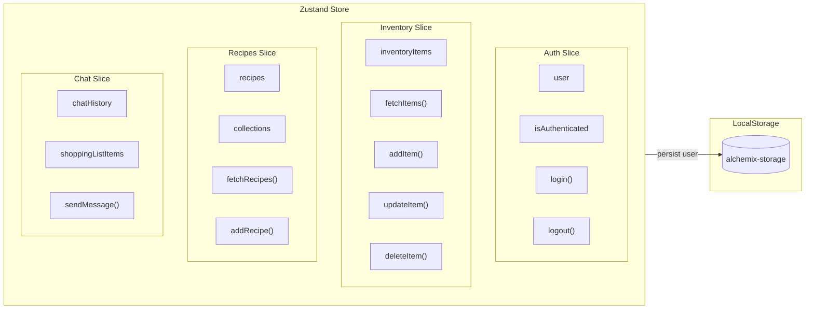

---

## Backend Architecture

### API Routes

```mermaid
graph TD
    subgraph Express["Express Server :3000"]
        subgraph Middleware
            CORS[CORS]
            JSON[JSON Parser]
            Cookie[Cookie Parser]
            RateLimit[Rate Limiter]
            Auth[Auth Middleware]
        end

        subgraph PublicRoutes["Public Routes"]
            POST_signup[POST /auth/signup]
            POST_login[POST /auth/login]
            POST_verify[POST /auth/verify-email]
            POST_forgot[POST /auth/forgot-password]
            POST_reset[POST /auth/reset-password]
            GET_health[GET /health]
        end

        subgraph ProtectedRoutes["Protected Routes (JWT)"]
            AUTH["/auth/*"]
            INV["/api/inventory/*"]
            REC["/api/recipes/*<br/>(search, bulk-move)"]
            COL["/api/collections/*"]
            FAV["/api/favorites/*"]
            MSG["/api/messages"]
            SHOP["/api/shopping-list/*"]
            GLASS["/api/glasses/*"]
        end
    end

    CORS --> JSON --> Cookie --> RateLimit
    RateLimit --> PublicRoutes
    RateLimit --> Auth --> ProtectedRoutes
```

### Service Layer

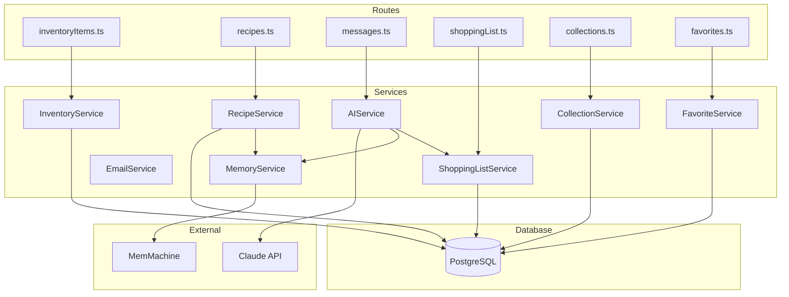

---

## Database Schema

### Entity Relationship Diagram

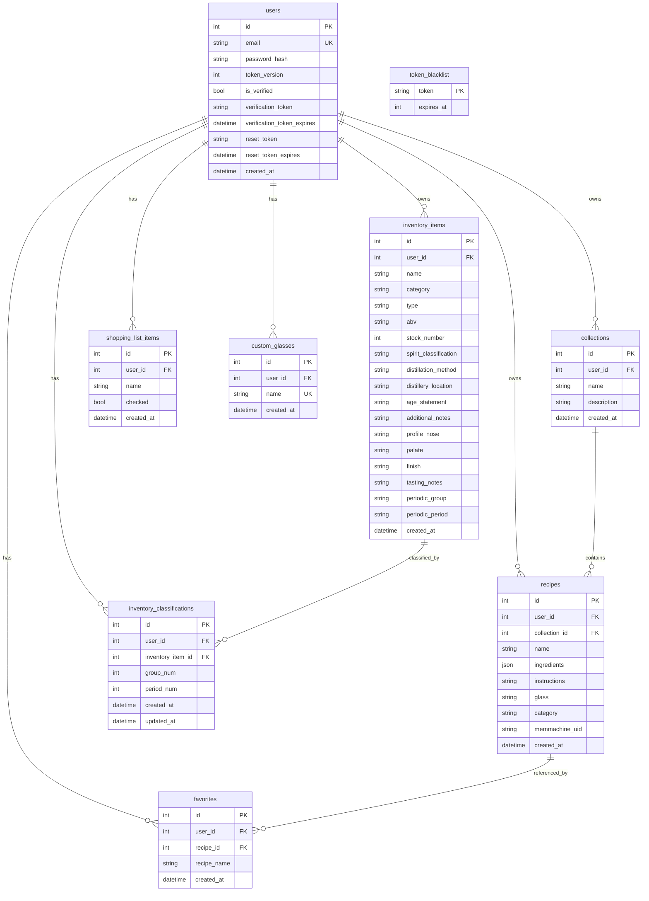

### Table Summary

| Table | Purpose | Key Relations |
|-------|---------|---------------|
| `users` | User accounts & auth | Parent of all user data |
| `inventory_items` | Bar inventory | user_id → users |
| `recipes` | Cocktail recipes | user_id → users, collection_id → collections |
| `collections` | Recipe folders | user_id → users |
| `favorites` | Saved recipes | user_id → users, recipe_id → recipes |
| `shopping_list_items` | Shopping list | user_id → users |
| `custom_glasses` | User-defined glasses | user_id → users |
| `inventory_classifications` | Periodic table overrides | user_id, inventory_item_id |
| `token_blacklist` | Revoked JWTs | Standalone |

---

## Authentication Flow

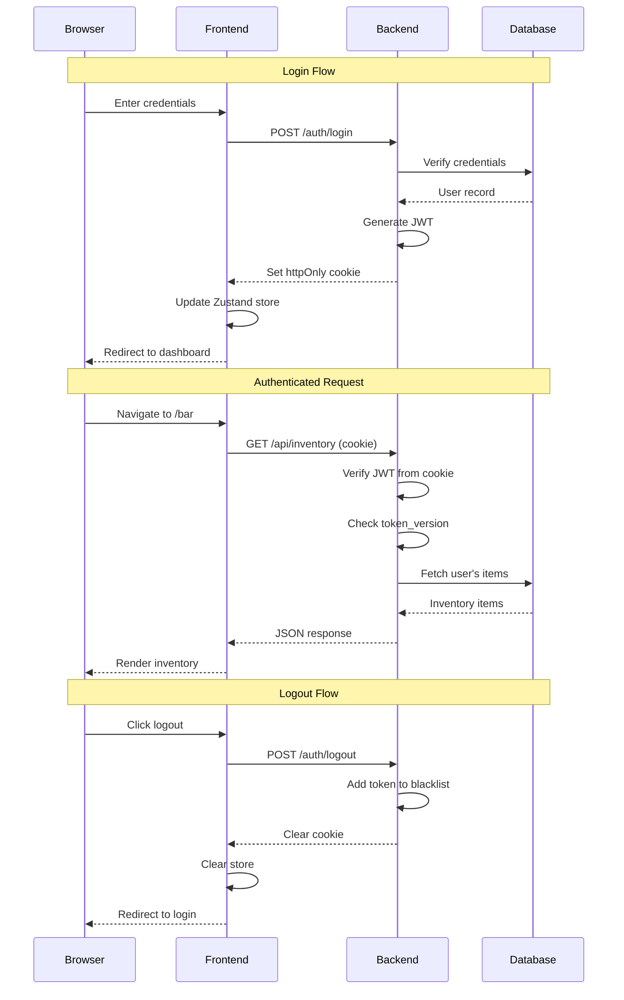

### Security Features

- **HttpOnly Cookies**: JWT stored in httpOnly cookie (XSS protection)
- **Token Versioning**: Database-backed version for instant invalidation
- **Token Blacklist**: Persisted blacklist for logout/password change
- **Rate Limiting**: Per-user request limits
- **CSRF Protection**: SameSite cookie attribute
- **Password Hashing**: bcrypt with 10 rounds

---

## Data Flow

### Adding an Inventory Item

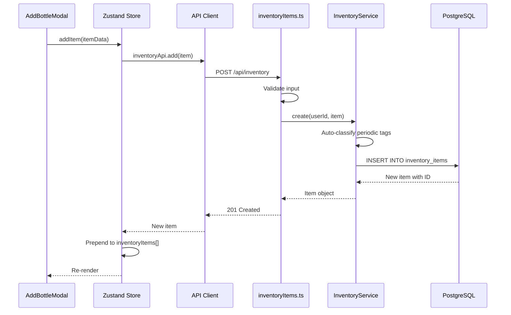

### AI Bartender Chat

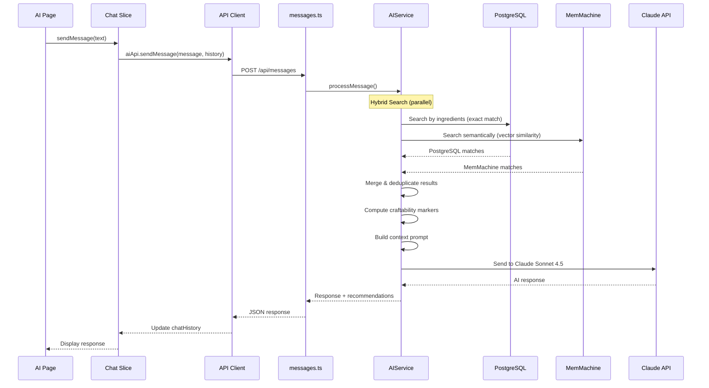

---

## External Integrations

### Claude AI Integration

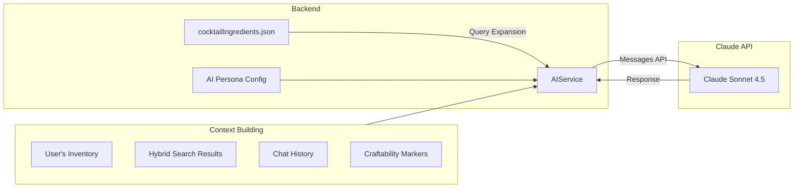

### Hybrid Search Architecture

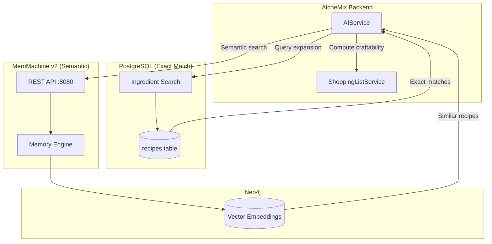

**Hybrid Search Features:**
- **PostgreSQL ingredient matching**: Fast exact search with 100+ cocktail query expansions
- **MemMachine semantic search**: Vector similarity for recipe discovery
- **Intelligent prioritization**: Specific ingredients (green chartreuse) searched before generic (gin, lime)
- **Pre-computed craftability markers**: ✅ CRAFTABLE, ⚠️ NEAR-MISS, ❌ MISSING verified against user inventory
- **Per-user isolation**: `org: alchemix`, `project: user_{id}_recipes`

---

## Port Reference

| Service | Port | Description |
|---------|------|-------------|
| Frontend (Next.js) | 3001 | Development server |
| Backend (Express) | 3000 | API server |
| MemMachine | 8080 | Semantic memory API |
| Neo4j HTTP | 7474 | Graph database UI |
| Neo4j Bolt | 7687 | Graph database protocol |
| PostgreSQL | 5432 | MemMachine profile storage |

---

## Design System Reference

The frontend uses the **"Molecular Mixology"** design system. Key design tokens are defined in `src/styles/globals.css`.

### Theme Management

AlcheMix supports light, dark, and system (browser preference) themes:

| Component | Purpose |
|-----------|---------|
| `ThemeProvider` | Wraps root layout, applies theme from localStorage on page load |
| `useSettings` | Hook for reading/setting theme preference (stored in `alchemix-settings`) |
| `data-theme` | HTML attribute set to `light` or `dark`, used by CSS selectors |

**Theme Detection Pattern** (used in components needing theme-aware colors):
```typescript
const [isDarkMode, setIsDarkMode] = useState(false);
useEffect(() => {
  const checkTheme = () => {
    const theme = document.documentElement.getAttribute('data-theme');
    setIsDarkMode(theme === 'dark');
  };
  checkTheme();
  const observer = new MutationObserver(checkTheme);
  observer.observe(document.documentElement, { attributes: true, attributeFilter: ['data-theme'] });
  return () => observer.disconnect();
}, []);
```

### Color Palette

| Variable | Value | Usage |
|----------|-------|-------|
| `--bond-agave` | `#0D9488` | Tequila, Mezcal |
| `--bond-grain` | `#D97706` | Whiskey, Bourbon |
| `--bond-cane` | `#65A30D` | Rum, Cachaça |
| `--bond-juniper` | `#0EA5E9` | Gin |
| `--bond-grape` | `#7C3AED` | Brandy, Cognac |
| `--bond-botanical` | `#EC4899` | Amaro, Vermouth |
| `--bond-acid` | `#F59E0B` | Citrus |
| `--bond-sugar` | `#6366F1` | Syrups, Liqueurs |

### Dark Mode Colors (Periodic Table)

The periodic table uses theme-aware colors with `colorDark` variants for visibility on dark backgrounds:

| Group | Light Mode | Dark Mode | Notes |
|-------|------------|-----------|-------|
| Base | `#1E293B` | `#94A3B8` | Critical - dark slate invisible on dark bg |
| Bridge | `#7C3AED` | `#A78BFA` | Lighter violet |
| Modifier | `#EC4899` | `#F472B6` | Lighter pink |
| Sweetener | `#6366F1` | `#818CF8` | Lighter indigo |
| Reagent | `#F59E0B` | `#FBBF24` | Lighter amber |
| Catalyst | `#EF4444` | `#F87171` | Lighter red |

### Typography

| Font | Usage |
|------|-------|
| Inter | UI text, headings |
| JetBrains Mono | Data, measurements, code |

---

## Quick Commands Reference

```bash
# Development
npm run dev:all          # Start frontend + backend
npm run type-check       # TypeScript checks (all packages)

# Testing
cd api && npm test       # Backend tests (876)
npm test                 # Frontend tests (206)
cd packages/recipe-molecule && npm test  # Molecule tests (124)

# Docker (for MemMachine)
docker compose -f docker/docker-compose.yml up -d
```

---

## Dependency Map

### Backend Module Dependencies

```
┌─────────────────────────────────────────────────────────────────────────────┐
│                              server.ts (Entry Point)                         │
└─────────────────────────────────────────────────────────────────────────────┘
                                      │
          ┌───────────────────────────┼───────────────────────────┐
          ▼                           ▼                           ▼
┌─────────────────┐         ┌─────────────────┐         ┌─────────────────┐
│    config/      │         │   middleware/   │         │    routes/      │
├─────────────────┤         ├─────────────────┤         ├─────────────────┤
│ env.ts          │◄────────│ auth.ts         │         │ auth/           │
│ validateEnv.ts  │         │ csrf.ts         │         │ inventoryItems  │
│ rateLimiter.ts  │────────►│ errorHandler.ts │         │ recipes         │
└─────────────────┘         │ requestId.ts    │         │ collections     │
        │                   │ requestLogger.ts│         │ favorites       │
        │                   │ userRateLimit.ts│         │ messages        │
        ▼                   └─────────────────┘         │ shoppingList    │
┌─────────────────┐                 │                   │ glasses         │
│ express-rate-   │                 ▼                   │ classifications │
│ limit           │         ┌─────────────────┐         │ health          │
└─────────────────┘         │   utils/        │         └─────────────────┘
                            ├─────────────────┤                 │
                            │ logger.ts ──────│──► winston      │
                            │ inputValidator  │                 │
                            │ passwordValid.  │                 │
                            │ tokenBlacklist  │                 │
                            │ asyncHandler    │                 │
                            │ corsConfig      │                 ▼
                            └─────────────────┘         ┌─────────────────┐
                                    │                   │   services/     │
                                    │                   ├─────────────────┤
                                    ▼                   │ InventoryService│
                            ┌─────────────────┐         │ RecipeService   │
                            │   errors/       │         │ CollectionSvc   │
                            ├─────────────────┤         │ FavoriteService │
                            │ AppError.ts     │         │ GlassService    │
                            │ index.ts        │         │ ClassificationS │
                            └─────────────────┘         │ ShoppingListSvc │
                                                        │ AIService ──────│──► @anthropic-ai/sdk
                                                        │ MemoryService ──│──► MemMachine API
                                                        │ EmailService ───│──► nodemailer
                                                        └─────────────────┘
                                                                │
                                                                ▼
                                                        ┌─────────────────┐
                                                        │   database/     │
                                                        ├─────────────────┤
                                                        │ db.ts ──────────│──► pg (node-postgres)
                                                        └─────────────────┘
```

### Backend Dependency Matrix

| Module | Depends On | External Packages |
|--------|-----------|-------------------|
| `server.ts` | config/*, middleware/*, routes/* | express, cors, helmet, cookie-parser |
| `config/env.ts` | - | dotenv |
| `config/validateEnv.ts` | - | (pure) |
| `config/rateLimiter.ts` | - | express-rate-limit |
| `middleware/auth.ts` | database/db, utils/tokenBlacklist | jsonwebtoken |
| `middleware/csrf.ts` | - | (pure) |
| `middleware/errorHandler.ts` | errors/AppError, utils/logger | (pure) |
| `middleware/requestId.ts` | - | crypto (built-in) |
| `middleware/requestLogger.ts` | utils/logger | (pure) |
| `middleware/userRateLimit.ts` | - | (pure, in-memory) |
| `routes/auth/*` | services/EmailService, database/db | bcryptjs, jsonwebtoken |
| `routes/inventoryItems.ts` | services/InventoryService | (pure) |
| `routes/recipes.ts` | services/RecipeService | (pure) - supports search/mastery filtering, bulk-move |
| `routes/messages.ts` | services/AIService, MemoryService | (pure) |
| `services/InventoryService.ts` | database/db | (pure) |
| `services/RecipeService.ts` | database/db, MemoryService | (pure) - server-side search, bulkMove |
| `services/AIService.ts` | ShoppingListService, data/cocktailIngredients.json | @anthropic-ai/sdk |
| `services/ShoppingListService.ts` | database/db | (pure) |
| `services/MemoryService.ts` | utils/logger | fetch (built-in) |
| `services/EmailService.ts` | config/validateEnv | nodemailer |
| `utils/logger.ts` | - | winston |
| `database/db.ts` | - | pg (node-postgres) - pure PostgreSQL, no legacy wrappers |

### Frontend Module Dependencies

```
┌─────────────────────────────────────────────────────────────────────────────┐
│                          app/layout.tsx (Root)                               │
└─────────────────────────────────────────────────────────────────────────────┘
                                      │
          ┌───────────────────────────┼───────────────────────────┐
          ▼                           ▼                           ▼
┌─────────────────┐         ┌─────────────────┐         ┌─────────────────┐
│  components/    │         │     lib/        │         │    hooks/       │
│  layout/        │         │                 │         │                 │
├─────────────────┤         ├─────────────────┤         ├─────────────────┤
│ TopNav.tsx      │◄────────│ store.ts ───────│──► zustand│ useAuthGuard   │
│ TopNavWrapper   │         │ api.ts ─────────│──► fetch │ useVerifGuard  │
└─────────────────┘         │ periodicTable/  │         └─────────────────┘
        │                   └─────────────────┘                 │
        ▼                           │                           │
┌─────────────────┐                 │                           │
│  components/    │                 ▼                           │
│  modals/        │         ┌─────────────────┐                 │
├─────────────────┤         │  app/pages/     │◄────────────────┘
│ AddBottleModal  │◄────────├─────────────────┤
│ AddRecipeModal  │         │ dashboard/      │
│ EditBottleModal │         │ bar/            │──► PeriodicTableV2, BottleCard
│ RecipeDetail    │         │ recipes/        │──► RecipeCard, RecipeMolecule
│ CSVUploadModal  │         │ ai/             │
│ CollectionModal │         │ favorites/      │
│ DeleteConfirm   │         │ shopping-list/  │
└─────────────────┘         │ settings/       │
        │                   │ account/        │
        ▼                   └─────────────────┘
┌─────────────────┐                 │
│  components/    │                 ▼
│  ui/            │         ┌─────────────────┐
├─────────────────┤         │  packages/      │
│ Button.tsx      │         │  recipe-molecule│
│ Card.tsx        │         ├─────────────────┤
│ Input.tsx       │◄────────│ core/parser     │
│ Modal.tsx       │         │ core/classifier │
│ Toast.tsx       │         │ core/layout     │
│ Spinner.tsx     │         │ core/bonds      │
│ ElementCard     │         │ components/     │
└─────────────────┘         └─────────────────┘
```

### Frontend Dependency Matrix

| Module | Depends On | External Packages |
|--------|-----------|-------------------|
| `lib/store.ts` | lib/api.ts | zustand, zustand/middleware |
| `lib/api.ts` | - | fetch (built-in) |
| `lib/periodicTable/*` | - | (pure) |
| `app/bar/page.tsx` | lib/store, PeriodicTableV2, modals | react |
| `app/recipes/page.tsx` | lib/store, RecipeCard, modals | react |
| `components/RecipeMolecule.tsx` | @alchemix/recipe-molecule | react |
| `hooks/useAuthGuard.ts` | lib/store | react, next/navigation |

### Package Dependencies

```
packages/recipe-molecule/
├── src/core/
│   ├── parser.ts ────────────► (pure TypeScript)
│   ├── classifier.ts ────────► (pure TypeScript)
│   ├── layout.ts ────────────► (pure, force-directed)
│   ├── bonds.ts ─────────────► (pure, geometry)
│   ├── formula.ts ───────────► (pure)
│   └── types.ts ─────────────► (type definitions)
└── src/components/
    └── *.tsx ────────────────► react, react-dom

packages/types/
└── src/*.ts ─────────────────► (pure TypeScript types)
```

### External Service Dependencies

```
┌─────────────────────────────────────────────────────────────────────────────┐
│                              AlcheMix Backend                                │
└─────────────────────────────────────────────────────────────────────────────┘
                │                    │                    │
                ▼                    ▼                    ▼
        ┌───────────────┐   ┌───────────────┐   ┌───────────────┐
        │  PostgreSQL   │   │  MemMachine   │   │  Claude API   │
        │   (Docker)    │   │  (Docker)     │   │  (Anthropic)  │
        ├───────────────┤   ├───────────────┤   ├───────────────┤
        │ Users         │   │ POST /store   │   │ Messages API  │
        │ Inventory     │   │ POST /query   │   │ sonnet-4.5    │
        │ Recipes       │   │ DELETE /mem   │   │ max_tokens:   │
        │ Collections   │   │               │   │ 1024          │
        │ Favorites     │   └───────┬───────┘   └───────────────┘
        │ Classifications│          │
        └───────────────┘          ▼
                           ┌───────────────┐
                           │    Neo4j      │
                           │   (Docker)    │
                           ├───────────────┤
                           │ Vector Store  │
                           │ GDS Plugin    │
                           └───────────────┘
                                   │
                                   ▼
                           ┌───────────────┐
                           │  PostgreSQL   │
                           │   (Docker)    │
                           ├───────────────┤
                           │ Profile Store │
                           └───────────────┘
```

---

## Security Architecture

### Middleware Security Stack

```
Request Flow:
───────────────────────────────────────────────────────────────────────────────►

┌──────────┐ ┌──────────┐ ┌──────────┐ ┌──────────┐ ┌──────────┐ ┌──────────┐
│requestId │►│requestLog│►│ helmet   │►│  cors    │►│  csrf    │►│  auth    │
│(correlate)│ │(audit)   │ │(headers) │ │(origin)  │ │(tokens)  │ │(jwt)     │
└──────────┘ └──────────┘ └──────────┘ └──────────┘ └──────────┘ └──────────┘
     │            │            │            │            │            │
     ▼            ▼            ▼            ▼            ▼            ▼
  X-Request-ID  Winston    CSP, HSTS    Whitelist   Double-Submit  HttpOnly
  UUID v4       JSON logs  X-Frame     Origins      Cookie         JWT Cookie
```

### Rate Limiter Configuration

| Limiter | Window | Max Requests | Purpose |
|---------|--------|--------------|---------|
| `apiLimiter` | 15 min | 100 | General API protection |
| `authLimiter` | 15 min | 5 (failed) | Login brute-force prevention |
| `aiLimiter` | 1 hour | 30 | API cost control |
| `importLimiter` | 1 hour | 10 | Large file upload DoS |
| `passwordResetLimiter` | 1 hour | 3 | Reset email spam |
| `logoutLimiter` | 15 min | 10 | Token blacklist exhaustion |
| `changePasswordLimiter` | 1 hour | 3 | Password brute-force |
| `verificationLimiter` | 1 hour | 3 | Verification email spam |
| `bulkOperationsLimiter` | 15 min | 10 | Mass deletion DoS |

### Logging Architecture

```
┌─────────────────────────────────────────────────────────────────────────────┐
│                             Winston Logger                                   │
├─────────────────────────────────────────────────────────────────────────────┤
│  Transports:                                                                │
│  ├── Console (development) - colorized, human-readable                      │
│  └── File (production) - JSON, rotated                                      │
├─────────────────────────────────────────────────────────────────────────────┤
│  Log Levels: error > warn > info > debug                                    │
├─────────────────────────────────────────────────────────────────────────────┤
│  Automatic Metadata:                                                        │
│  ├── service: "alchemix-api"                                                │
│  ├── environment: NODE_ENV                                                  │
│  ├── requestId: X-Request-ID                                                │
│  └── timestamp: ISO 8601                                                    │
├─────────────────────────────────────────────────────────────────────────────┤
│  Sensitive Data Redaction:                                                  │
│  password, token, apikey, secret, authorization, ssn, creditcard, cvv      │
└─────────────────────────────────────────────────────────────────────────────┘
```

---

*Last updated: December 18, 2025*
