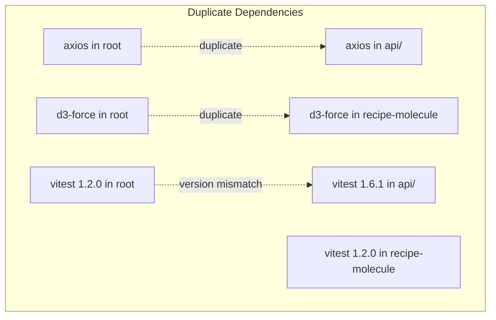
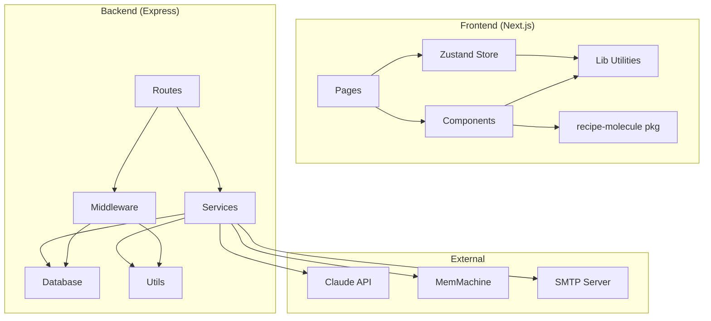

# AlcheMix Codebase Analysis & Refactoring Recommendations

**Analyzed**: December 14, 2025
**Version**: v1.30.0
**Total Lines of Code**: ~52,500 (TypeScript)

---

## Table of Contents

1. [Executive Summary](#executive-summary)
2. [Dependency Analysis](#dependency-analysis)
3. [Code Quality Issues](#code-quality-issues)
4. [Legacy Code Reference](#legacy-code-reference)
5. [Refactoring Recommendations](#refactoring-recommendations)
6. [Priority Action Items](#priority-action-items)

---

## Executive Summary

### Health Score: 7.5/10

**Strengths:**
- Clean monorepo structure with npm workspaces
- Consistent TypeScript usage across all packages
- Good separation of concerns (routes → services → database)
- Comprehensive test coverage (818 tests)
- Well-documented code with JSDoc comments

**Areas for Improvement:**
- Some large files should be split
- 219 uses of `any` type need fixing
- Duplicate dependencies between packages
- Console.log statements in production code

---

## Dependency Analysis

### External Dependencies

#### Frontend (package.json)
| Dependency | Version | Status | Notes |
|------------|---------|--------|-------|
| next | ^14.1.0 | Current | App Router |
| react | ^18.2.0 | Current | |
| zustand | ^4.5.0 | Current | State management |
| axios | ^1.6.5 | Current | **Duplicate** - also in api/ |
| lucide-react | ^0.555.0 | Current | Icons |
| d3-force | ^3.0.0 | Current | Molecule visualization |
| isomorphic-dompurify | ^2.33.0 | Current | XSS protection |

#### Backend (api/package.json)
| Dependency | Version | Status | Notes |
|------------|---------|--------|-------|
| express | ^4.22.1 | Current | Web framework |
| better-sqlite3 | ^9.2.2 | Current | Database |
| bcrypt | ^5.1.1 | Current | Password hashing |
| jsonwebtoken | ^9.0.2 | Current | JWT auth |
| helmet | ^7.1.0 | Current | Security headers |
| axios | ^1.6.5 | **Duplicate** | Only used for MemMachine calls |
| winston | ^3.18.3 | Current | Logging |
| nodemailer | ^7.0.11 | Current | Email service |

#### Recipe Molecule Package
| Dependency | Version | Status | Notes |
|------------|---------|--------|-------|
| d3-force | ^3.0.0 | **Duplicate** | Already in root package.json |

### Dependency Issues



**Recommendations:**
1. Remove `axios` from api/package.json - it's only used for MemMachine HTTP calls, could use native fetch
2. Remove `d3-force` from root package.json - only used by recipe-molecule (should be peer dependency)
3. Align vitest versions across all packages to `^1.6.1`

---

## Code Quality Issues

### 1. TypeScript `any` Usage (219 instances)

**Severity**: Medium

| Location | Count | Notes |
|----------|-------|-------|
| api/src/database/db.test.ts | 16 | SQLite query results |
| api/src/errors/AppError.ts | 4 | Error details typing |
| api/src/routes/*.ts | ~30 | Request body typing |
| src/lib/*.ts | ~20 | Various utility functions |
| Test files | ~150 | Test mocks and assertions |

**Most Critical Files:**
```
api/src/errors/AppError.ts - details?: any
api/src/services/MemoryService.ts - Multiple any casts
src/lib/periodicTableV2.ts - Classification maps
```

**Recommendation:** Create proper TypeScript interfaces for:
- SQLite query results
- Error details
- Request/response bodies
- MemMachine API responses

### 2. Console.log Statements (248 in production code)

**Severity**: Low-Medium

Most are in:
- `api/scripts/` - Acceptable for CLI scripts
- `api/src/database/db.ts` - Startup logging (acceptable)
- `api/src/server.ts` - Startup logging (acceptable)

**Should be removed/replaced with logger:**
- Any console.log in route handlers
- Debug statements in services

### 3. Large Files (>500 lines)

| File | Lines | Issue |
|------|-------|-------|
| `api/src/routes/auth.ts` | 1,585 | Too many responsibilities |
| `api/src/routes/auth.test.ts` | 1,683 | Consider splitting |
| `src/lib/periodicTableV2.ts` | 1,341 | Large data + logic mixed |
| `api/src/database/db.ts` | 1,188 | Schema + migrations mixed |
| `api/src/routes/messages.ts` | 1,187 | AI logic in route handler |
| `api/src/routes/shoppingList.ts` | 1,141 | Complex business logic |
| `src/app/recipes/page.tsx` | 967 | Too much in one component |
| `api/src/routes/inventory.ts` | 959 | Legacy file (see below) |

### 4. TODO/FIXME Comments (8 found)

All in test files for unimplemented features:
```
src/components/ui/Button.test.tsx:
  - TODO: Implement loading prop feature
  - TODO: Implement icon prop feature

src/components/ui/Input.test.tsx:
  - TODO: Implement required indicator feature
  - TODO: Implement helperText prop feature
  - TODO: Implement clearable feature
  - TODO: Implement showPasswordToggle feature
  - TODO: Implement prefixIcon feature
  - TODO: Implement suffixIcon feature
```

---

## Legacy Code Reference

### Files to Clean Up

| File | Status | Action |
|------|--------|--------|
| `src/lib/store.ts.backup` | Dead code | **Delete** - old backup file |

### Legacy Periodic Table Implementation (KEEP FOR REFERENCE)

The following files contain the **original V1 Periodic Table implementation**. These are preserved in case reversion is needed.

#### V1 Files (Legacy - Keep for Reference)
| File | Lines | Purpose |
|------|-------|---------|
| `src/lib/periodicTable.ts` | 435 | Original element definitions, GROUP_COLORS, PERIODIC_SECTIONS |
| `src/components/PeriodicTable.tsx` | 159 | Original grid component |
| `src/components/PeriodicTable.module.css` | 150 | Original styling |
| `src/components/ui/ElementCard.tsx` | 91 | Element card component (uses V1 types) |
| `src/components/ui/ElementCard.module.css` | 90 | Element card styling |

#### V2 Files (Current - Active)
| File | Lines | Purpose |
|------|-------|---------|
| `src/lib/periodicTableV2.ts` | 1,341 | New classification engine with matching |
| `src/components/PeriodicTableV2/PeriodicTable.tsx` | 200 | New grid component |
| `src/components/PeriodicTableV2/ElementCell.tsx` | 234 | New cell with dropdown |
| `src/components/PeriodicTableV2/ElementDetailPanel.tsx` | 250 | Detail panel component |

#### Key Differences V1 vs V2

| Feature | V1 | V2 |
|---------|----|----|
| Element Data | Static `PERIODIC_SECTIONS` | Dynamic `ELEMENTS` 6x6 grid |
| Classification | Simple name matching | Word-boundary matching with scores |
| Cell Display | Single element | Multiple elements per cell with dropdown |
| User Inventory | Highlights owned elements | Shows actual bottles in cells |
| Interaction | Click → callback | Click → dropdown → select element type |

#### V1 Data Structure (periodicTable.ts)
```typescript
interface PeriodicElement {
  symbol: string;      // 2-3 letter code
  name: string;        // Full name
  atomicNumber: number;
  group: ElementGroup; // 'agave' | 'grain' | 'cane' | etc.
  keywords: string[];  // Matching keywords
}

// Organized by sections (Spirits, Liqueurs, Citrus, etc.)
const PERIODIC_SECTIONS = {
  spirits: PeriodicElement[],
  liqueurs: PeriodicElement[],
  // ...
}
```

#### V2 Data Structure (periodicTableV2.ts)
```typescript
interface Element {
  symbol: string;
  name: string;
  spec?: string;       // ABV%, Brix, pH
  keywords: string[];
}

// 6x6 grid organized by Group (columns) and Period (rows)
const ELEMENTS: Record<MixologyGroup, Record<MixologyPeriod, Element[]>> = {
  Base: { Agave: [...], Cane: [...], ... },
  Bridge: { ... },
  // ...
}
```

### Legacy Inventory Route

| File | Status | Notes |
|------|--------|-------|
| `api/src/routes/inventory.ts` | **Legacy** | Original inventory routes using direct DB queries |
| `api/src/routes/inventoryItems.ts` | **Active** | New inventory routes using InventoryService |

The old `inventory.ts` is not imported in `server.ts` but kept for reference. It contains:
- Direct SQLite queries (not service pattern)
- CSV import logic
- Pagination implementation

---

## Refactoring Recommendations

### Priority 1: Immediate Cleanup (Low Risk)

#### 1.1 Delete Confirmed Dead Files
```bash
rm src/lib/store.ts.backup
```

### Priority 2: Code Organization (Medium Risk)

#### 2.1 Split Large Route Files

**auth.ts (1,585 lines) → Split into:**
```
api/src/routes/auth/
├── index.ts          # Re-exports router
├── login.ts          # POST /login, /logout
├── signup.ts         # POST /signup
├── password.ts       # POST /forgot-password, /reset-password, /change-password
├── verification.ts   # POST /verify-email, /resend-verification
└── account.ts        # GET /me, DELETE /account, GET /export, POST /import
```

**messages.ts (1,187 lines) → Extract AI logic:**
```
api/src/routes/messages.ts     # HTTP layer only (~200 lines)
api/src/services/AIService.ts  # AI prompt building, context assembly
api/src/services/MemoryService.ts  # Already exists, keep as-is
```

**shoppingList.ts (1,141 lines) → Extract business logic:**
```
api/src/routes/shoppingList.ts        # HTTP layer (~300 lines)
api/src/services/ShoppingListService.ts  # New service for business logic
```

#### 2.2 Split Large Frontend Pages

**recipes/page.tsx (967 lines) → Extract components:**
```
src/app/recipes/
├── page.tsx              # Main page shell (~200 lines)
├── RecipeFilters.tsx     # Mastery filters, spirit filters
├── RecipeGrid.tsx        # Grid display logic
├── RecipeActions.tsx     # Bulk operations, CSV import
└── useRecipesPage.ts     # Custom hook for page state
```

#### 2.3 Split periodicTableV2.ts (1,341 lines)

```
src/lib/periodicTable/
├── index.ts              # Re-exports
├── elements.ts           # ELEMENTS data constant
├── classification.ts     # CLASSIFICATION_MAP, matching logic
├── types.ts              # TypeScript interfaces
└── utils.ts              # Helper functions
```

### Priority 3: Dependency Cleanup (Low Risk)

#### 3.1 Remove Duplicate axios from API
```json
// api/package.json - Remove axios, use native fetch for MemMachine
// Or keep axios but remove from root package.json
```

#### 3.2 Align Vitest Versions
```json
// All package.json files should use:
"vitest": "^1.6.1"
```

#### 3.3 Move d3-force to Peer Dependency
```json
// packages/recipe-molecule/package.json
"peerDependencies": {
  "d3-force": "^3.0.0",  // Move from dependencies
  "react": "^18.0.0",
  "react-dom": "^18.0.0"
}
```

### Priority 4: Type Safety Improvements (Medium Effort)

#### 4.1 Create Shared Types Package
```
packages/types/
├── package.json
├── src/
│   ├── api.ts          # API request/response types
│   ├── database.ts     # Database row types
│   ├── domain.ts       # Business domain types
│   └── index.ts
```

#### 4.2 Replace `any` with Proper Types

**High-priority files:**
1. `api/src/errors/AppError.ts` - Create `ErrorDetails` type
2. `api/src/services/MemoryService.ts` - Create `MemMachineResponse` types
3. `api/src/routes/auth.ts` - Use Express typed request/response

---

## Priority Action Items

### Immediate (This Session)

| # | Action | Risk | Effort |
|---|--------|------|--------|
| 1 | Delete `src/lib/store.ts.backup` | None | 1 min |

### Short-term (Next Few Sessions)

| # | Action | Risk | Effort |
|---|--------|------|--------|
| 2 | Split `auth.ts` into sub-modules | Medium | 2-3 hrs |
| 3 | Extract AI logic from `messages.ts` | Medium | 1-2 hrs |
| 4 | Create ShoppingListService | Medium | 1-2 hrs |
| 5 | Align dependency versions | Low | 30 min |

### Medium-term (When Needed)

| # | Action | Risk | Effort |
|---|--------|------|--------|
| 6 | Split `recipes/page.tsx` into components | Medium | 2-3 hrs |
| 7 | Split `periodicTableV2.ts` into modules | Low | 1-2 hrs |
| 8 | Create shared types package | Medium | 3-4 hrs |
| 9 | Eliminate all `any` types | Medium | 4-6 hrs |

### Low Priority (Keep for Reference)

| # | Item | Notes |
|---|------|-------|
| - | `src/lib/periodicTable.ts` | V1 implementation - keep for reference |
| - | `src/components/PeriodicTable.tsx` | V1 component - keep for reference |
| - | `api/src/routes/inventory.ts` | Legacy route - keep for reference |

---

## Dependency Graph



---

## Metrics Summary

| Metric | Value | Target | Status |
|--------|-------|--------|--------|
| Total LoC | ~52,500 | - | - |
| Test Coverage | 818 tests | - | Good |
| `any` Usage | 219 | 0 | Needs Work |
| Legacy Files | 5 | - | Keep for Reference |
| Large Files (>500 loc) | 12 | <5 | Needs Splitting |
| Console.log (prod) | ~50 | 0 | Review Needed |
| Duplicate Deps | 3 | 0 | Cleanup Required |

---

*Generated: December 14, 2025*
